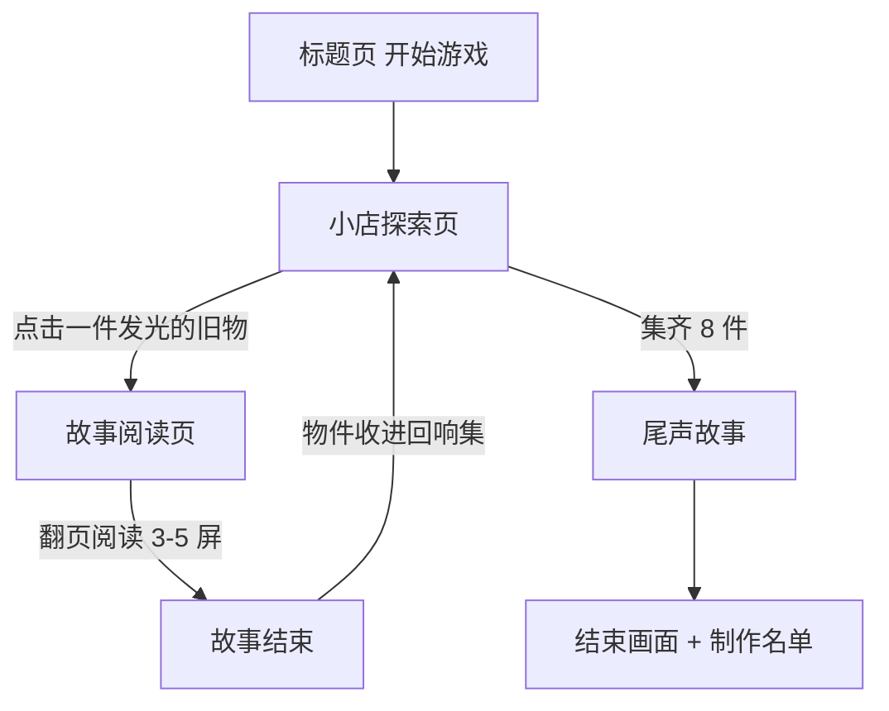

# 《旧物回响》产品需求文档(PRD)

| 项目 | 内容 |
|---|---|
| 游戏名称 | 旧物回响 |
| 类型 | 温情向短篇互动叙事游戏(网页版) |
| 平台 | 浏览器(手机优先,兼容桌面),托管于 GitHub Pages |
| 单次通关时长 | 15–25 分钟 |
| 价格 | 免费,无内购无广告 |
| 文档状态 | v0.2,已确认:方案 A + 旧物小店场景 + 8 件物件 |
| 更新日期 | 2026-09-04 |

---

## 〇、项目协作约定(整个项目期内有效)

本节由用户特别要求记录,双方约定如下:

1. 用户是编程小白,不提供具体技术要求,只表达想要的效果和感受。
2. 所有需要决策的事项(技术栈、工具、设计风格等),由 AI 列出 2–3 个备选方案,用大白话解释每个方案的优劣势,并给出推荐及理由,最终由用户选择。
3. 每个阶段产出物先交用户查看确认,再进入下一阶段。
4. 涉及技术术语时,必须附带一句话的大白话解释,不让用户查词典。
5. 目标部署平台为 GitHub Pages(免费静态网页托管服务),即游戏最终是一个纯前端网页,无需服务器。

---

## 一、项目概述

一句话概念:守一间旧物小店,每件寄卖的旧物,都封存着一段普通人的回忆。

《旧物回响》是一个 15–25 分钟的短篇互动游戏。玩家扮演接手旧物小店的店主,在整理货架时一件件拿起旧物——搪瓷缸、缝纫机、铁皮青蛙……每件物件触发一段独立的小故事。八件旧物都被"摸过"之后,游戏以一段收束的尾声作结。

体验目标:玩家合上浏览器时,想起自己家里某件舍不得扔的旧东西。

目标用户:喜欢《去月球》《风之旅人》这类情感向作品,或刷到"老物件修复"视频会停下来看的普通人;无年龄门槛,无操作门槛。

---

## 二、世界观与故事设定

### 2.1 世界观核心

旧物不说话,但它们记得。

巷子深处有间旧货铺,老店主陈伯要回乡养老了,把铺子转给了"你"。交接那天,他在柜台上压了一张字条:"店里的东西,都是别人托我卖的。每一件,我都听过它的故事。你得一件一件亲手摸过,才算真正接下这间店。"

你拂去货架上的灰,拿起第一件旧物。指尖停留的瞬间,记忆像灰尘一样轻轻扬起——你看见物件经过的一双又一双手:工厂里的学徒、新婚的妻子、盼儿归的母亲、共用一只铁皮青蛙的兄弟。

都是普通人,普通事。故事不喊口号、不堆苦难,像傍晚斜进店门的光。

### 2.2 叙事结构

- 框架(首尾):开头是接手小店、读到字条;结尾是八件旧物都被摸过之后,字条背面浮现老店主的最后一句话,你把门口的牌子翻成"营业中"——第一位客人推门进来,怀里抱着一件旧物。回响,继续。
- 中段(主体):每件旧物一段独立小故事,300–800 字,彼此不依赖,可按任意顺序阅读。物件都是不同人寄卖的,因此故事的主角、年代、职业天然多样。
- 尾声:集齐全部物件后解锁,回扣框架,给出情感收束。

叙述采用第二人称"你",玩家角色即店主,无姓名、无性别指向,最大化代入感。

### 2.3 初版物件清单(8 件,均为店中寄卖旧物)

| # | 物件 | 年代背景 | 故事内核(一句话) |
|---|---|---|---|
| 1 | 搪瓷缸(印"劳动最光荣") | 1970s 国营工厂 | 学徒第一次拿到先进生产者奖品的那个下午 |
| 2 | 红双喜铁皮饼干盒 | 1980s | 盒底压着一沓信:一段隔着一条江的婚事 |
| 3 | 蝴蝶牌缝纫机 | 1970s–80s | 母亲把大人的旧衣,改成孩子过年的新衣 |
| 4 | 熊猫牌收音机 | 1980s 独居老人 | 评书、晚风和每晚六点半的陪伴 |
| 5 | 铁皮青蛙(上弦玩具) | 1970s 兄弟俩 | 一只玩具两个人的童年,和一次没吵赢的架 |
| 6 | 老式胶片相机 | 1990s 县城照相馆 | 师傅拍下的第一千张全家福 |
| 7 | 军绿色水壶 | 1970s 退伍军人 | 父亲退伍返乡的行李里,最沉的一件 |
| 8 | 绣花手帕 | 1960s | 没有寄出去的那句"我等你" |

数量说明:已确认初版做 8 件。故事存于独立数据文件,上线后增补第 9、10 件不需改动代码。

### 2.4 内容红线

- 不出现真实人名、可对号入座的真实事件;时代背景只做氛围,不做历史陈述。
- 不悲惨结局堆叠:可以有遗憾,但落点必须是温暖或释然。

---

## 三、玩法设计

### 3.1 核心循环

核心循环:探索小店(点击旧物)→ 进入一段回忆(文字 + 插画 + 音乐)→ 读完,物件收入"回响集" → 继续探索 → 集齐 8 件 → 解锁尾声。

### 3.2 探索玩法

旧物小店探索页是一张手绘店内插画(初版一个场景:货架、柜台与窗台)。8 件寄卖旧物以插画元素的形式摆放在店内各处,尚未阅读的物件带轻微的呼吸式微光提示,读过的物件恢复黯淡。玩家自由点击,顺序完全开放。页面上方或角落显示进度"已唤醒 3 / 8 件旧物"。

提示设计照顾两类玩家:想自己找的人,微光提示足够含蓄;没耐心的人,连续 30 秒无有效点击时,微光变亮一级。不做"提示按钮",避免打断氛围。

### 3.3 阅读体验

- 文字逐字浮现(打字机效果,每字约 40 毫秒),单击任意处立即补全本屏文字,再次单击翻页。
- 一屏不超过 120 字,手机竖屏一屏读完不滚动。
- 叙事结构(改版中):原版每段故事为 3–5 屏线性阅读 + 结尾 1 个轻选择;现升级为多分支互动叙事,搪瓷缸为打样——14 个剧情节点、3 个选择点(选项带性格倾向标签)、3 条结局线、1 个隐藏彩蛋。人物插画在角色首登场/重大转折/结局定格处以「画中画」呈现:整幅完整显示居中,四周同图深模糊铺底,选项区固定于页面底部,正文区独立滚动,互不遮挡。其余 7 件待打样确认后按同一模板改写,剧本规格见《分支剧本-搪瓷缸》。
- 重玩激励:回响集卡片显示"回忆结局 x / 3",新结局解锁时提示;隐藏彩蛋仅特定结局第一次触发。
- 故事结束时有"收进箱子"的动作反馈,伴随一声轻响。

### 3.4 收集系统(回响集)

- 入口:探索页角落的箱子图标,随时可进。
- 形态:8 格网格图鉴。未解锁的物件显示为剪影加一个"?";解锁后显示物件插画 + 一句题记(从该故事中摘出)。
- 已解锁物件可点击重读故事(复读入口,不占用流程)。
- 全收集时图鉴页出现提示:"货架空了。把门口的牌子翻过来吧。"引导回探索页触发尾声。

### 3.5 存档

自动存档,使用浏览器的 localStorage(存在玩家自己设备上的小容量存储)记录:已读物件、各故事内的选择、是否看过尾声。玩家关掉浏览器再回来,从标题页"继续经营"进入,回到探索页。换设备或清缓存进度会丢失——短篇游戏可接受,不做账号系统。

---

## 四、界面设计

### 4.1 页面清单

| # | 页面 | 内容与职责 |
|---|---|---|
| 1 | 标题页 | 游戏名、副标题、开始按钮、继续经营(有存档时)、音量开关;背景为黄昏巷口的小店外景插画 |
| 2 | 小店探索页 | 核心玩法页,店内插画 + 可点旧物 + 进度显示 + 回响集入口 |
| 3 | 故事阅读页 | 全屏沉浸,插画为底或右侧配图,文字区居中偏下,翻页提示 |
| 4 | 回响集页 | 8 格物件图鉴,可重读 |
| 5 | 尾声与结束页 | 尾声故事 + 结束画面(店里亮着灯,门牌翻成"营业中") + 制作名单 + 重新开始 |

### 4.2 视觉风格

- 色调:复古暖色系——米黄、牛皮纸棕、暗红点缀,整体像旧照片偏暖的一侧。
- 插画:手绘水彩 / 怀旧插画风,AI 生成时用统一风格提示词控制(详见第五章)。
- 质感:页面底纹叠加轻纸张纹理,降低纯白纯黑对比,长时间阅读不刺眼。
- 字体:思源宋体或霞鹜文楷(均为开源可商用中文字体),标题大字号、正文适中行距。
- 动效克制:只保留微光呼吸、打字机、物件收入箱三种动效,其余全静态。

### 4.3 响应式

手机竖屏为主设计稿(玩家大多用手机打开分享链接);桌面端内容居中,两侧留背景色,不做强制横屏。

---

## 五、AIGC 内容产出方案

### 5.1 故事文本(大模型生成)

生产流程:AI 按"物件 + 人物 + 情绪落点"三要素,每件物件生成 2–3 版初稿(合计约 20 篇)→ 用户挑版本、提修改意见 → AI 润色定稿 → 按下方数据结构存入游戏。

每篇质量标准:300–800 字;有具体可感的年代细节(粮票、的确良、搪瓷掉瓷的地方),不写空泛抒情;结尾留一口余味,不总结中心思想。

存储格式:内容与代码分离,所有故事存为一份 JSON 数据文件(结构:物件 ID、名称、题记、分页文本数组、选择分支、插画文件名、音乐轨道)。后续增删故事只改数据文件,不动游戏代码。

### 5.2 插画(AI 生图)

清单:8 张物件特写(图鉴与阅读页共用)+ 3 张场景图(标题页小店外景、探索页店内初始与尾声状态)≈ 11 张,另留 30% 余量应对废稿。

统一风格提示词模板:"手绘水彩插画,怀旧暖色调,米黄与棕色,柔和光影,纸张颗粒质感,中国 1970–90 年代生活物件,画面干净无文字"。

规格:竖版或方形,实际导出 JPEG、物件图 800×800(约 100–150 KB)、场景图 900×1600(约 400 KB),总插画体积约 1.9 MB。

版权注意:选用明确允许商用/免费使用的生成工具,产物直接公开在 GitHub 仓库,需留意所选工具的输出版权条款。

### 5.3 音乐与音效(已执行)

- BGM 三首,选用 Kevin MacLeod(incompetech.com)免版权曲目,CC BY 4.0 许可(免费商用,需署名,已在结束画面署名):
  - 主界面/探索:Meditation Impromptu 02(宁静)
  - 阅读页:Heartwarming(温暖)
  - 尾声:Gymnopedie No 1(释然)
- 文件存于 assets/bgm/,均已按 mp3 帧边界裁剪至约 2 分钟循环,单首 3–4 MB,进入对应页面时才加载(懒加载)。
- 播放规则(已实现):首次点击"开始游戏"后才启动音乐(浏览器自动播放限制);音轨切换带 0.8 秒淡入淡出;默认音量 50%;标题页与店内均有"音乐 开/关"按钮,状态本地保存。
- 音效三则(翻页、唤醒、收入箱)暂未加入,列为后续打磨项。

---

## 六、技术栈方案(已选定:方案 A)

> 用户已确认(2026-09-04):采用方案 A,纯 HTML + CSS + JavaScript。以下三个方案的完整对比保留存档,便于日后回看决策依据。

三个方案都能做出这个游戏并部署到 GitHub Pages,差别在于:你要不要装环境、界面上限、以及以后扩展方不方便。每个方案 AI 都会代写全部代码,你不需要写代码。

### 方案 A:纯 HTML + CSS + JavaScript(零工具链)

做法:整个游戏就是一组网页文件(index.html 加上样式、脚本、图片、音乐),双击 index.html 就能在浏览器里玩,原样上传 GitHub Pages 即上线。

优势:
- 不需要安装任何开发环境,不碰命令行。
- 部署最简单:文件放进仓库就上线,出错概率最低。
- 没有中间概念(依赖、构建),AI 改完文件刷新浏览器立即看到效果。

劣势:
- 图片音乐不经过自动优化压缩,首屏加载比打包方案稍慢(本游戏体量小,差距可接受)。
- 以后若要加复杂功能(云存档、多语言),代码组织会逐渐吃力。
- 手写项目没有统一结构规范,换人接手成本高(本项目全程 AI 维护,影响有限)。

### 方案 B:Twine(专为互动故事设计的免费工具)

做法:在 Twine 的可视化编辑器里像画流程图一样连线写故事,导出一个 HTML 文件,上传即上线。

优势:
- 就是为互动小说设计的,写故事、连分支有图形界面,所见即所得。
- 导出即部署,也很简单。

劣势:
- 界面美观度受模板限制,做出"手绘房间探索 + 图鉴收集"的效果要大量覆写 CSS/JS,反而比直接写网页更绕。
- 图片与音乐管理能力弱,不适合"每件物件一张插画 + 独立音轨"的结构。
- AI 协作成熟度不如主流网页技术,后期维护被动。

结论:适合纯文字冒险;与本项目"探索 + 图鉴"玩法不匹配,列出仅为完整对比。

### 方案 C:Vite + Vue 3(现代前端框架)

做法:在电脑上安装 Node.js(一种让电脑能运行 JavaScript 工具的环境),用 Vite 建项目(帮你自动组织代码和优化文件的脚手架),AI 用 Vue 3 编写组件,开发完成后跑一条命令生成优化好的静态文件,再上传 GitHub Pages。

优势:
- 组件化:每件物件的故事页是独立模块,以后加第 9、10 件故事非常轻松。
- 主流技术,AI 生成代码质量与资料丰富度最高。
- 自动压缩合并图片音乐,加载速度上限更高。
- 未来扩展(设置页、动画增强、多语言)空间最大。

劣势:
- 需要一次性安装 Node.js 环境(约 10 分钟,AI 带着做)。
- 存在"构建"步骤:改完代码要先跑一条命令生成发布文件,再上传(也可配置 GitHub Actions 让服务器自动构建,一次性配置)。
- 对用户多两层需要理解的概念,虽然实际操作仍由 AI 完成。

### 汇总对比

| 维度 | A 纯 HTML/JS | B Twine | C Vite + Vue 3 |
|---|---|---|---|
| 需要装环境 | 不用 | 不用 | 要装 Node.js |
| 部署步骤 | 拖文件即上线 | 导出即上线 | 先构建再上传(可自动化) |
| 视觉与交互上限 | 中高 | 低到中 | 高 |
| 探索 + 图鉴玩法实现 | 顺手 | 费劲 | 最顺手 |
| AI 代写顺畅度 | 高 | 中 | 最高 |
| 后续加内容成本 | 低(改数据文件) | 中 | 最低 |
| 后续加复杂功能上限 | 中 | 低 | 高 |

### 推荐

方案 A。理由:本游戏是一次性短篇体验、玩法轻、内容靠数据文件驱动,方案 A 的能力完全覆盖;你全程不需要碰代码,"维护性差"的劣势实际由 AI 承担;部署零门槛,今天做完今天就能上线。如果你确定以后要把它做成持续更新的系列(比如每月加一件新物件、加新房间),那方案 C 的长期收益更大。

---

## 七、部署方案(GitHub Pages)

无论选哪个技术方案,最终都是把"静态文件"放进 GitHub 仓库。全流程由 AI 逐步带操作,用户只需注册账号和点击确认:

1. 注册 / 登录 GitHub(全球最大代码托管平台,免费)。
2. 新建一个公开仓库(仓库即项目文件夹),例如命名为 `old-echoes`。
3. 上传游戏文件(方案 C 则上传构建产物,或配置自动构建)。
4. 仓库 Settings → Pages → 选择 main 分支 → 保存。
5. 等待约 1 分钟,通过 `https://用户名.github.io/old-echoes/` 访问游戏,链接可发朋友。

---

## 八、项目推进路线

按阶段推进,每阶段结束向用户展示并确认后进入下一阶段:

1. 产品文档确认(已完成,2026-09-04)。
2. 搭建项目骨架:做一个"能点开、能翻页"的空壳版本。
3. AIGC 内容生产:先出 1 件物件(搪瓷缸)的完整内容(故事 2 版初稿 + 插画 + BGM 选型)打样,确认风格后批量产出其余 7 件。
4. 游戏开发:探索页 → 阅读页 → 回响集 → 尾声,逐页可玩。
5. 本地完整通关 + 手机实测 + 打磨(文字节奏、音量、加载速度)。
6. GitHub Pages 上线,交付分享链接。

---

## 九、决策记录

| # | 决策项 | 结果 | 确认日期 |
|---|---|---|---|
| 1 | 技术栈 | 方案 A:纯 HTML + CSS + JavaScript | 2026-09-04 |
| 2 | 故事主场景 | 旧物小店(老店主陈伯转店,玩家接手成为新店主) | 2026-09-04 |
| 3 | 初版物件数量 | 8 件(完整版) | 2026-09-04 |
| 4 | BGM 方案 | 方案 B(下载免版权曲)。FreePD 关站后改用 incompetech CC BY 曲目,已在结束画面署名 | 2026-09-04 |
| 5 | 叙事结构 | 升级为多分支互动叙事:先以搪瓷缸打样(3 选择点/3 结局/隐藏彩蛋/人物插画),玩家确认风格后批量改写其余 7 件 | 2026-09-05 |
